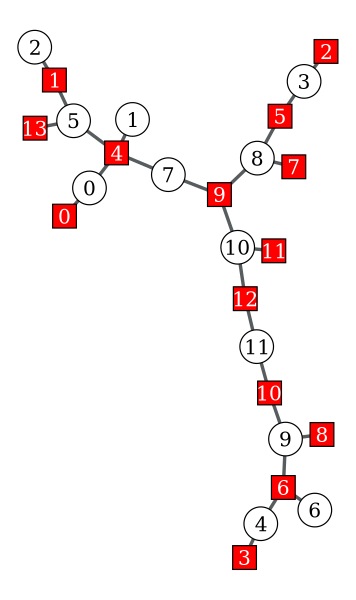
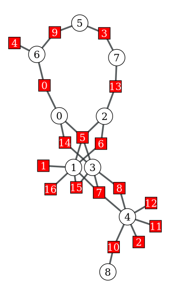

# Factor Graph Visualizer
A short script written in python3 for factor graph visualization.

## Setup 
This script relies on the [graph-tool](https://graph-tool.skewed.de) utility.
Please follow the installing instructions on their webpage before using this script.

## Usage:
```shell
python visualise.py -i /path/to/matrix.txt -o drawn_graph.png
```
## Examples

##### First example
Given the following matrix:
```
14 12
1     0     0     0      0      0      0      0      0      0      0      0 
0     0     1     0      0      1      0      0      0      0      0      0 
0     0     0     1      0      0      0      0      0      0      0      0 
0     0     0     0      1      0      0      0      0      0      0      0 
1     1     0     0      0      1      0      1      0      0      0      0 
0     0     0     1      0      0      0      0      1      0      0      0 
0     0     0     0      1      0      1      0      0      1      0      0 
0     0     0     0      0      0      0      0      1      0      0      0 
0     0     0     0      0      0      0      0      0      1      0      0 
0     0     0     0      0      0      0      1      1      0      1      0 
0     0     0     0      0      0      0      0      0      1      0      1 
0     0     0     0      0      0      0      0      0      0      1      0 
0     0     0     0      0      0      0      0      0      0      1      1 
0     0     0     0      0      1      0      0      0      0      0      0 
```

The generated factor graph is:



##### Second example
Given the following matrix:

```
1         0         0         0         0         0         1         0         0
0         1         0         0         0         0         0         0         0
0         0         0         0         1         0         0         0         0
0         0         0         0         0         1         0         1         0
0         0         0         0         0         0         1         0         0
1         1         1         1         0         0         0         0         0
0         1         1         0         0         0         0         0         0
0         1         0         1         1         0         0         0         0
0         0         0         1         1         0         0         0         0
0         0         0         0         0         1         1         0         0
0         0         0         0         1         0         0         0         1
0         0         0         0         1         0         0         0         0
0         0         0         0         1         0         0         0         0
0         0         1         0         0         0         0         1         0
1         0         0         1         0         0         0         0         0
0         1         0         1         0         0         0         0         0
0         1         0         0         0         0         0         0         0
```

The generated factor graph is:


